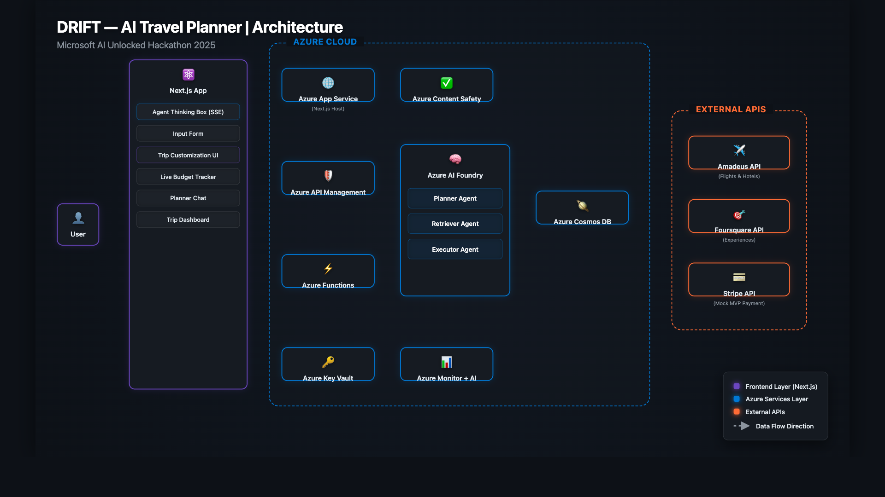

# ✈️ DRIFT — AI-Powered Travel Planner

DRIFT is an agentic travel planning platform built on Azure AI Foundry.
It uses three coordinated AI agents to plan, retrieve, and book
complete travel itineraries — all within a user's budget.

## Architecture



```
drift-travel-ai/
├── .env
├── .gitignore
├── README.md
├── agents/                   # Core agent logic
│   ├── content_safety.py
│   ├── executor_agent.py
│   ├── planner_agent.py
│   ├── prompts.py
│   └── retriever_agent.py
├── apps/
│   ├── api/                  # Azure Functions (Python)
│   │   ├── agents/           # Symlinks to core agent logic
│   │   ├── config.py
│   │   ├── db.py
│   │   ├── function_app.py
│   │   ├── host.json
│   │   ├── local.settings.template.json
│   │   └── requirements.txt
│   └── web/                  # Next.js 14 frontend
│       ├── .env.local
│       ├── next.config.ts
│       ├── package.json
│       ├── public/
│       ├── src/
│       │   ├── app/
│       │   ├── components/
│       │   └── lib/
│       └── tsconfig.json
├── architecture/
│   ├── diagram.html
│   └── diagram.png
├── infra/                    # Azure Bicep IaC
│   ├── main.bicep
│   └── modules/
│       └── resources.bicep
└── shared/
    └── types/                # Shared TypeScript types
        └── index.ts
```

| Layer | Technology |
|-------|-----------|
| Frontend | Next.js 14 (App Router + TypeScript + Tailwind CSS) |
| Backend | Azure Functions v4 (Python 3.11) |
| AI | Azure AI Foundry (GPT-4o) — 3 agents |
| Database | Azure Cosmos DB (NoSQL) |
| Secrets | Azure Key Vault |
| Payments | Stripe (test mode) |
| Guardrails | Azure AI Content Safety |

## Agents

| Agent | Role |
|-------|------|
| **Planner Agent** | Creates structured itinerary from user input, handles chat-based edits |
| **Retriever Agent** | Fetches live flights, hotels (Amadeus), and experiences (Foursquare) |
| **Executor Agent** | Books travel, processes Stripe payment, generates PDF + QR codes |

## Getting Started

### Prerequisites
- Azure CLI (logged in)
- Node.js 18+
- Python 3.11+
- Azure subscription

### Free API Keys Needed
- [Amadeus](https://developers.amadeus.com) — Flights + Hotels (free test env, 2,000 calls/month)
- [Foursquare](https://location.foursquare.com/) — Experiences (free tier)
- [Stripe](https://stripe.com) — Payments (test mode, free forever)

### Setup

```bash
# Clone
git clone https://github.com/YOUR_USERNAME/drift-travel-ai
cd drift-travel-ai

# Deploy Azure infrastructure
az deployment sub create --template-file infra/main.bicep

# Install frontend deps
cd apps/web && npm install

# Install backend deps
cd ../api && pip install -r requirements.txt

# Add API keys to Azure Key Vault (never in .env)
az keyvault secret set --vault-name drift-kv --name amadeus-api-key --value YOUR_KEY
az keyvault secret set --vault-name drift-kv --name amadeus-api-secret --value YOUR_SECRET
az keyvault secret set --vault-name drift-kv --name foursquare-api-key --value YOUR_KEY
az keyvault secret set --vault-name drift-kv --name stripe-key --value YOUR_KEY
```

### Deploy to Azure

**1. Create Core Infrastructure & Database**
```bash
# Set variables
RG="drift-travel-rg"
LOCATION="eastus"

# Create Resource Group
az group create --name $RG --location $LOCATION

# Deploy Bicep template (CosmosDB, Key Vault, AI Services)
az deployment group create \
  --resource-group $RG \
  --template-file infra/main.bicep
```

**2. Deploy Backend (Azure Functions)**
```bash
cd apps/api

# Create Storage Account (required for Functions)
az storage account create --name driftfuncstorage --resource-group $RG --location $LOCATION --sku Standard_LRS

# Create Python Function App (Linux Consumption)
az functionapp create --name drift-api-func \
  --resource-group $RG \
  --storage-account driftfuncstorage \
  --consumption-plan-location $LOCATION \
  --runtime python --runtime-version 3.11 --os-type Linux

# Publish code to Function App
func azure functionapp publish drift-api-func --python --build remote
```

**3. Deploy Frontend (Next.js App Service)**
```bash
cd apps/web
npm run build

# Create App Service Plan (B1 basic Linux)
az appservice plan create --name drift-web-plan --resource-group $RG --is-linux --sku B1

# Create Web App
az webapp create --name drift-travel-web \
  --resource-group $RG \
  --plan drift-web-plan \
  --runtime "NODE:18-lts"

# Deploy Next.js bundle via ZipDeploy
cd out
zip -r ../app.zip .
cd ..
az webapp deployment source config-zip --resource-group $RG --name drift-travel-web --src app.zip
```

### Run Locally

```bash
# Terminal 1 — Backend
cd apps/api && func start

# Terminal 2 — Frontend
cd apps/web && npm run dev
```

### Environment Variables (Local Dev)

Create `apps/web/.env.local`:
```
NEXT_PUBLIC_API_URL=http://localhost:7071/api
```

Create `apps/api/local.settings.json` (already templated in repo):
```json
{
  "IsEncrypted": false,
  "Values": {
    "AzureWebJobsStorage": "UseDevelopmentStorage=true",
    "FUNCTIONS_WORKER_RUNTIME": "python",
    "COSMOS_ENDPOINT": "https://drift-cosmos.documents.azure.com:443/",
    "COSMOS_KEY": "your_cosmos_key",
    "OPENAI_API_KEY": "your_openai_key",
    "AMADEUS_API_KEY": "your_amadeus_key",
    "AMADEUS_API_SECRET": "your_amadeus_secret",
    "FOURSQUARE_API_KEY": "your_foursquare_key",
    "STRIPE_SECRET_KEY": "your_stripe_test_key",
    "AZURE_CONTENT_SAFETY_ENDPOINT": "your_endpoint",
    "AZURE_CONTENT_SAFETY_KEY": "your_key"
  }
}
```

## Responsible AI

All agent outputs pass through **Azure AI Content Safety**
before reaching the UI. Guardrails cover harmful content,
PII exposure, and off-topic requests.

## Security
- Azure Managed Identity for all service-to-service auth
- No API keys in code — only Key Vault references
- Input sanitization before every agent call
- CORS locked to frontend domain only

## Resilience & Fallbacks
All LLM JSON outputs are parsed defensively. The `PlannerAgent` includes graceful fallbacks:
- If the LLM generates conversational text instead of strict JSON (e.g., placing emojis outside JSON blocks), the system intercepts the `JSONDecodeError`.
- Instead of returning a generic connection fault, it extracts the raw text and seamlessly passes it down as the plain conversational reply.
- Prompt instructions are strongly typed to output `actions` for UI modifications (like `suggest_hotels`) to prevent chat window clutter.

## License
MIT
